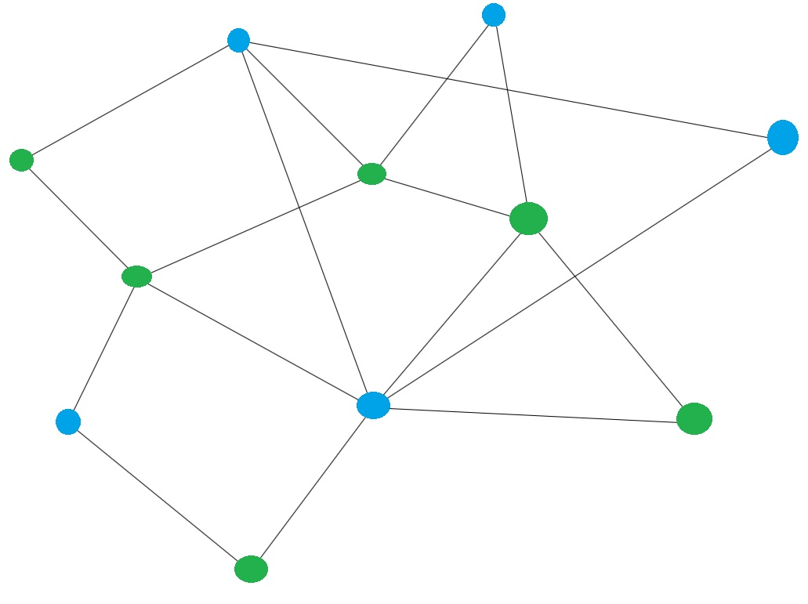
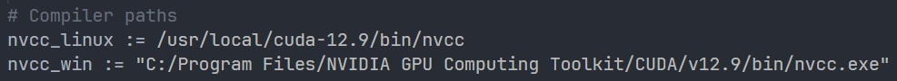
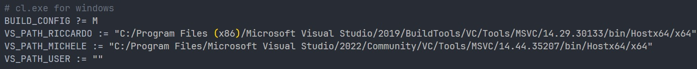
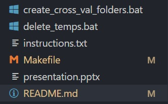
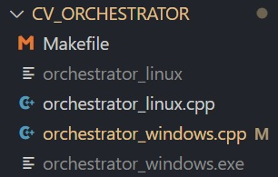

## About the Project


This project evaluates the performance of different implementations of the **Forward Algorithm** for counting triangles in a graph.  
It provides both a sequential baseline and parallelized versions, where parallelization is achieved using **CPU multithreading** and **GPU acceleration**.

---

## Getting Started

The following guide explains how to set up and run the program on a **Windows** machine.

### Prerequisites
- A Windows computer  
- An **NVIDIA GPU** compatible with the CUDA Toolkit  
- At least **16 GB of RAM**  
- `make` and `g++`  
- `cl.exe` from **Visual Studio Tools**  

> ⚠️ Installation of the CUDA Toolkit, `make`, and `g++` is not covered in this guide.

---

### Configure the Makefile

1. Copy the path to `nvcc.exe`.  
2. Open the **Makefile** in the project folder.  
3. Paste the path between quotes (`""`) in the variable `nvcc_win`.  



4. Copy the path to `cl.exe`.  
5. Open the **Makefile** again.  
6. Paste the path between quotes (`""`) in the variable `VS_PATH_USER`.  



---

### Compilation

#### Compile Algorithms
The **Makefile** in the project folder automatically compiles all algorithms.  
Run the following command:

```bash
make OS=windows BUILD_CONFIG=U

```



#### Compile Orchestrator
The **Orchestrator** (in the folder `CV_ORCHESTRATOR`) runs all algorithms in a single execution and saves performance results in the `cross_validation_output folder`.

To compile `orchestrator_windows.cpp`, go to the `CV_ORCHESTRATOR` subdirectory and run:

```bash
make OS=windows
``` 



---

### run orchestrator
From the `CV_ORCHESTRATOR` folder, run the Orchestrator with the following command, replacing <GPU_MODEL> with the name of your GPU:

```bash
.\orchestrator_windows.exe <GPU_MODEL>
```

### results
Each algorithm saves its performance results in a dedicated folder (named after the algorithm) inside `cross_validation_output`. The results are stored as .csv files with the following format `graphName_GPU_User.csv`.